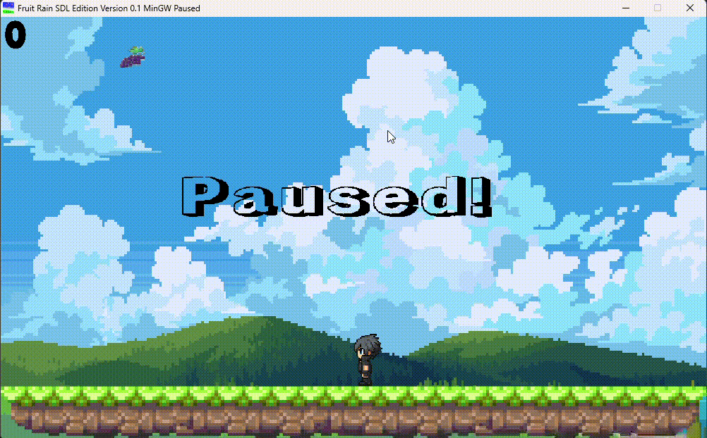

# Fruit-Rain-SDL
Hello and welcome to Fruit Rain SDLized or SDL edition 🎮

A simple game where fruits fall from the sky and you have to catch them before they hit the ground!

This game is a remake of the game I produced in python some time ago (Original Version -> https://github.com/Ruaneri-Portela/Fruit-Rain), the idea is to explore the Class concepts in a more advanced way using C++.

As language chosen was C++ in special the version made available by the MSYS2 project (Windows GNU tools -> https://www.msys2.org/), because I have some experience with C/C++/C# family languages even in a primitive way.

SDL was chosen for being a lightweight library that forces the programmer to implement basic concepts like collision systems, sound manipulation and theards, things that I have been working hard on building this game.

